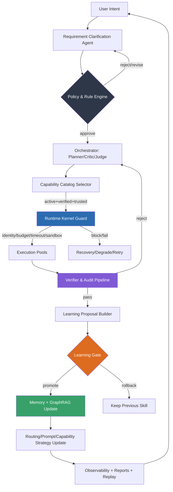

<p align="center">
  
</p>

# 🔄 AutoLoop
> A Rust-native AIOS for **governed agent execution**

[](https://github.com/rootkiller6788/AutoLoop/actions/workflows/ci.yml)
[](https://github.com/rootkiller6788/AutoLoop/releases/tag/v0.1.0-alpha)
[](https://www.rust-lang.org)
[](LICENSE)
[](#)


---

## 🎯 What Is AutoLoop?

**AutoLoop is a Rust-native AIOS for governed agent execution.**

It does not just call models and tools.  
It turns ambiguous intent into a **controlled runtime loop**:

```
clarify → plan → gate → execute → verify → remember → replay → improve
```

| Capability | What It Means |
|:---|:---|
| 🎯 **Structured Sessions** | Vague tasks become well-defined, traceable execution flows |
| 🛡️ **Policy-Guarded Runtime** | All actions pass through configurable policy & safety gates |
| 🔍 **Verifiable Outcomes** | Results can be audited, replayed, and deterministically validated |
| 🧠 **Active Memory** | Memory isn't passive storage — it actively feeds future reasoning |
| 📈 **Trust-Gated Learning** | System upgrades only when verification & trust conditions are met |

> ✨ **AutoLoop is for people who want more than "agent demos".**  
> **It is for building AI systems that can be governed.**

---

## 🤔 Why AutoLoop Exists

| Traditional Agent Systems | AutoLoop |
|:---|:---|
| ✅ More tools & integrations | ✅ **Controlled execution with runtime governance** |
| ✅ Longer autonomous chains | ✅ **Verifiable outcomes with audit trails** |
| ✅ Maximum autonomy | ✅ **Learning with explicit trust boundaries** |
| ✅ Polished demo experiences | ✅ **Operator visibility, replay, and intervention** |

> 🔹 **AutoLoop is not another free-form agent wrapper.**  
> 🔹 **It is a governed execution runtime for production-grade AI systems.**

---

## 🚀 5-Minute Demo

Get started instantly with pre-built demo scripts:

| Platform | Script | Description |
|:---|:---|:---|
| 🪟 Windows | [`demo/e2e-5min.ps1`](demo/e2e-5min.ps1) | Full end-to-end workflow on Windows PowerShell |
| 🐧 Linux/macOS | [`demo/e2e-5min.sh`](demo/e2e-5min.sh) | Full end-to-end workflow on Unix-like systems |
| 🎬 Recording Guide | [`demo/RECORDING_CHECKLIST.md`](demo/RECORDING_CHECKLIST.md) | Checklist for capturing demo runs |

---

## ⚡ Quick Start

### Prerequisites
- 🦀 Rust toolchain (`rustup` recommended)
- 🔐 (Optional) SpacetimeDB CLI for persistent state
- 🐳 (Optional) Docker / Docker Compose for containerized deployment

### Run a Swarm Task
```powershell
cargo run --manifest-path .\Cargo.toml -- \
  --message "Build a swarm that uses graph memory and MCP execution" \
  --swarm
```

### Validate & Test
```powershell
# Static checks
cargo check --workspace --manifest-path .\Cargo.toml

# Run test suite
cargo test --workspace --manifest-path .\Cargo.toml
```

### Browser Research Runtime
AutoLoop supports multiple real-world research backends:

| Backend | Description | Use Case |
|:---|:---|:---|
| `browser_fetch` | Browserless-style render endpoint | Lightweight page extraction |
| `playwright_cli` | Local Node + Playwright | Full browser automation |
| `firecrawl` | Firecrawl search/scrape APIs | Scalable web crawling |

**Health Checks:**
```powershell
# System health overview
cargo run --manifest-path .\Cargo.toml -- system health

# Crawl status for specific anchor
cargo run --manifest-path .\Cargo.toml -- crawl status --anchor-id cli:focus
```

---

## 🔄 Governance & Learning Flow



---

## 🏆 3 Core Differentiators

### 1️⃣ Governed Execution, Not Free-Form Calls
```rust
// Capabilities are cataloged, verified, and routed through guardrails
let capability = catalog
    .get("web_search")?
    .verify(&policy)?
    .with_guardrails(budget, timeout, sandbox);
```
- ✅ Explicit capability registration & versioning
- ✅ Runtime policy enforcement (domain, action, data egress)
- ✅ Identity, budget, timeout, and sandbox isolation per execution

### 2️⃣ Memory That Participates in Decisions
```rust
// GraphRAG + learning records actively influence routing & planning
let context = graph_rag
    .query(&intent)
    .merge(learning_records::recent(&skill_id))
    .weight_by_trust_score();
```
- ✅ Episodic memory with causal edge tracking
- ✅ Skill evolution with witness logs & verification proofs
- ✅ Trust-weighted retrieval for routing & prompt strategy

### 3️⃣ End-to-End Operability
```bash
# One repository, full operational stack
autoloop/
├── runtime (Rust)      # CLI + kernel + agents
├── spacetimedb/        # Persistent state module
├── adapter/            # SpacetimeDB ↔ Rust bridge
├── dashboard-ui/       # React observability frontend
├── deploy/             # Docker, K8s, CI/CD templates
└── tests/              # Unit, integration, E2E suites
```
- ✅ CLI-first runtime with structured JSON output
- ✅ SpacetimeDB for low-latency, replicated state
- ✅ Dashboard for session replay, audit trails, and metrics
- ✅ Deployment-ready templates for cloud & edge

---

## ✅ What's Implemented in v0.1.0-alpha

| Feature | Status | Description |
|:---|:---|:---|
| 🗣️ Multi-turn Clarification | ✅ | Scope freeze signals & requirement disambiguation |
| 🎭 CEO + Planner/Critic/Judge | ✅ | Orchestration artifacts with role separation |
| 🔐 Capability Catalog + Verifier | ✅ | Gated execution path with trust scoring |
| 🕸️ GraphRAG Pipeline | ✅ | Snapshot + incremental merge for contextual reasoning |
| 🧠 Learning Persistence | ✅ | Episodes, skills, causal edges, witness logs |
| 📊 Observability + Dashboard | ✅ | Structured logs + snapshot serving for replay |

---

## ⚠️ Current Scope (Honest Boundaries)

> This is an **engineering alpha**, not a fully production-hardened autonomous platform.

| Area | Current State | Roadmap |
|:---|:---|:---|
| 🔌 Provider/Tool Integrations | Functional, limited compatibility | Broaden support + harden error handling |
| 🧠 GraphRAG Depth | Basic snapshot + merge | Advanced retrieval strategies + caching |
| 🛡️ Verifier Policy | Rule-based gating | ML-assisted policy synthesis + adaptation |
| 📈 Learning Strategy | Trust-threshold promotion | Multi-objective optimization + human-in-the-loop |
| 🚀 Deployment | Docker + local SpacetimeDB | K8s operators + managed cloud offerings |

---

## 🗺️ Project Map

```
autoloop/
├── src/                          # 🦀 Runtime source (kernel, agents, CLI)
├── spacetimedb/                  # ⚡ Persistent state module (Rust WASM)
├── autoloop-spacetimedb-adapter/ # 🔗 Adapter crate for state sync
├── dashboard-ui/                 # 🎨 React observability frontend
├── deploy/                       # 🐳 Docker, K8s, CI/CD assets
├── tests/                        # 🧪 Unit, integration, E2E test suites
├── docs/                         # 📚 Deep documentation index
├── Cargo.toml                    # 📦 Workspace manifest
├── ARCHITECTURE.md               # 🏗️ System design overview
├── API.md                        # 🔌 API contract summary
├── CONTRIBUTING.md               # 🤝 How to contribute
├── LICENSE                       # 📜 MIT License
└── RELEASE_NOTES_v0.1.0-alpha.md # 🗒️ Current release details
```

---

## 📚 Documentation Index

| Document | Purpose |
|:---|:---|
| [`docs/README.md`](docs/README.md) | 🗂️ Master documentation index |
| [`docs/PROCESS_MODEL.md`](docs/PROCESS_MODEL.md) | 🔄 Neutral naming process model |
| [`docs/P1_P13_UNIFIED_PROTOCOL.md`](docs/P1_P13_UNIFIED_PROTOCOL.md) | 📜 AI output contract + layer flows |
| [`docs/RFC_CONTRACTS_V1.md`](docs/RFC_CONTRACTS_V1.md) | 🤝 Contracts specification v1 |
| [`docs/ROLLOUT_RUNBOOK.md`](docs/ROLLOUT_RUNBOOK.md) | 🚦 Gray rollout & operational runbook |
| [`ARCHITECTURE.md`](ARCHITECTURE.md) | 🏗️ High-level architecture deep dive |
| [`API.md`](API.md) | 🔌 API summary & usage examples |
| [`CONTRIBUTING.md`](CONTRIBUTING.md) | 🛠️ Contribution guidelines |
| [`RELEASE_NOTES_v0.1.0-alpha.md`](RELEASE_NOTES_v0.1.0-alpha.md) | 🗒️ Detailed v0.1.0-alpha changelog |
| [`docs/ISSUE_BACKLOG_v0.1.0-alpha.md`](docs/ISSUE_BACKLOG_v0.1.0-alpha.md) | 📋 Public issue backlog & roadmap |

---

## 🔒 Security & Responsible Use

- 🔐 **Secrets Management**: Never commit API keys; use `.env` or secret vaults
- 🌐 **Rate Limiting**: Built-in throttling for external APIs & LLM providers
- 🧹 **Data Isolation**: Execution sandboxes prevent cross-tenant data leakage
- 📜 Review [`SECURITY.md`](SECURITY.md) before deploying in production or multi-tenant environments

---

## 🤝 Contributing

We welcome contributions! Whether you want to:
- 🐞 Report a bug or propose a feature
- 🦀 Add a new agent role or runtime capability
- 🌍 Improve documentation, localization, or examples
- 🧪 Help expand test coverage or benchmarking

Please start here:
- 📜 [Code of Conduct](CODE_OF_CONDUCT.md)
- 🛠️ [Contributing Guide](CONTRIBUTING.md)
- 💬 [Discussion Forum](https://github.com/rootkiller6788/AutoLoop/discussions)

---

## 📜 License

Distributed under the **MIT License**. See [`LICENSE`](LICENSE) for details.

---

> 💡 **Pro Tip**: Run with `--verbose --trace` to observe agent reasoning, policy decisions, and memory updates in real time.  
> ⭐ If AutoLoop helps you build more governable AI systems, please Star the repo to support open-source AI infrastructure! 🚀🦀
